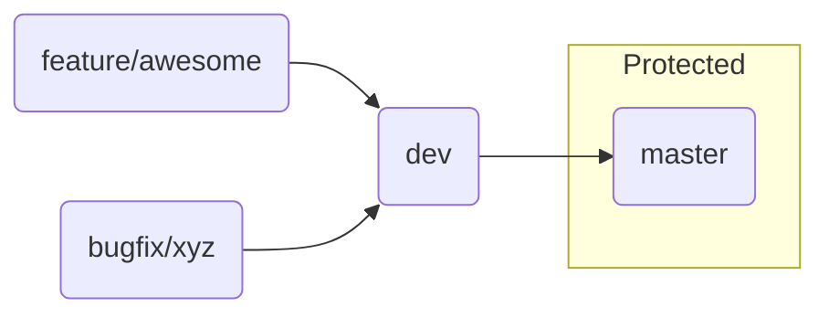

## 🛠️ Git Branching Workflow




### Branch purpose

|   Brandh  |                       Purpose                     |         Who can push?        |
| --------- | ------------------------------------------------- | ---------------------------- |
| master    | Production‑ready code, tagged releases            | Maintainers only (protected) |
|  dev      | Daily integration branch; CI runs full test suite | Developers & Maintainers     |
| feature/* | New features or experiments                       | Branch author                |


### Typical cycle
1. Start work
```
git checkout -b feature/<name> dev
```

2. Commit locally
```
git add -A && git commit -m "feat: …"
```

3. Share & review

   ``` git push -u origin feature/<name> ``` → Open Merge Request to dev

4. Integrate (CI green)
Maintainer merges MR → ```dev```

5. Release
Maintainer opens MR ```dev``` → ```master```; tag a version when merged

### Hot‑fix

URGENT? Branch from ```master```, merge back to both ```master``` and ```dev```

1. Create the hot‑fix branch from master
```
# make sure master is clean and up to date
git checkout master
git pull origin master

# create a descriptive hot‑fix branch
git checkout -b hotfix/critical-null-bug
```

2. Fix, test, commit, and push
```
# -- edit files in VS Code, run tests --

git add -A
git commit -m "fix: handle null value causing crash in reconciler"
git push -u origin hotfix/critical-null-bug
```

3. Open & merge the MR to master:
    
    3.1 In GitLab, open the MR, set the target branch to master, label it Hotfix.

    3.2 Pipeline should run; once green, a Maintainer clicks Merge (fast‑forward or no‑ff is fine).

    3.3 Optionally tag a release:
```
git checkout master
git pull origin master   # brings in the merged hot‑fix
git tag -a v1.2.1 -m "Hot‑fix release v1.2.1"
git push origin v1.2.1
```
4. Propagate the fix to dev
```
git checkout dev
git pull origin dev
git merge --no-ff master -m "chore: merge hot‑fix v1.2.1 from master"
git push origin dev
```

### Cheat-sheet summary

| Stage                  | Command                                                                |
| ---------------------- | ---------------------------------------------------------------------- |
| Start hot‑fix branch   | ```git checkout master``` → ```git pull``` → ```git checkout -b hotfix/<desc>```         |
| Commit & push          | ```git add -A``` → ```git commit -m "fix: …" ``` → ```git push -u origin hotfix/<desc>``` |
| Merge to master        | Open MR ```hotfix/* → master```, CI green, Maintainer merges                 |
| Tag release (optional) | ```git tag -a vX.Y.Z -m "Hot‑fix" ``` → ```git push origin vX.Y.Z```                |
| Sync dev               | ```git checkout dev``` → ```git pull``` → ```git merge --no-ff master``` → ```git push```      |


### Poetry Everyday Cheat-sheet

| Task                                       | Command                                                           |
| ------------------------------------------ | ----------------------------------------------------------------- |
| Upgrade pandas                             | ```poetry add pandas@latest```                                    |
| Add a dev‑only tool (e.g. black)           | ```poetry add --group dev black``` (or older Poetry: ```-D```)    |
| Open a shell inside the venv               | ```poetry shell```                                                |
| Export requirements.txt (for legacy tools) | ```poetry export -f requirements.txt --output requirements.txt``` |
| Remove a package                           | ```poetry remove pandas```                                        |
